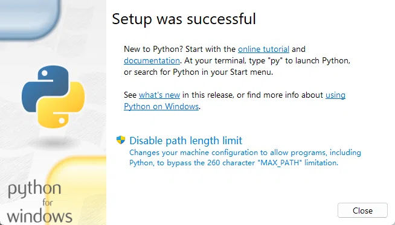

# 我的脚本合集

自己用的 Windows 小工具，主要是给 B 站录播做音量压缩、批量转字幕、文件批量改名这些事。
用 Git 同步到 GitHub：<https://github.com/Hao-kowk/Common-Scripts>

根目录只放正在用的 `.py` 脚本，其他东西都在 `其他\` 里。

---

## 一、新电脑第一件事：装 Python

脚本都是 Python 写的，一台电脑只需要装一次，全程不用改任何设置。

1. 打开 <https://www.python.org/downloads/>，点那个黄色按钮 `Download Python 3.x.x` 下载，然后双击安装包（3.12 或更新的都行）。
2. 第一屏最下面有个勾选框，**一定要勾上**（不勾后面会提示"不是内部或外部命令"）：

   - `Add python.exe to PATH`

   勾完直接点 `Install Now`。

3. 如果你点的是 `Customize installation`，那第二页（Optional Features）要保证这两个是勾上的：

   - `pip`
   - `Add Python to environment variables`

   

4. 后面几页不用动，一路 `Next` / `Install`，最后出现 `Close` 点掉就装完了。
5. 验证：按 `Win + R`，输入 `cmd` 回车，再输入 `python --version` 回车。

   - 显示 `Python 3.x.x` → 装好了。
   - 提示"不是内部或外部命令" → 第 2 步的勾没打上，重新双击安装包选 `Modify` 把勾补上。

> 为什么要勾这个：勾了以后系统在任何文件夹都认得 `python` 命令，脚本才能双击就跑。

## 二、另外还需要一个 ffmpeg

只有「音量处理」和「批量转字幕」要用到它。

脚本会按下面顺序自己找，找到哪个用哪个：

1. 脚本旁边的 `ffmpeg\bin\ffmpeg.exe`（把整个 ffmpeg 文件夹丢在脚本旁边最省事）
2. 系统环境变量 `PATH` 里的 ffmpeg（推荐，一劳永逸）
3. 两条写死的路径：`C:\ffmpeg\bin\` 和 `C:\Users\Halpc_TUF\Documents\Codex\ffmpeg\...\bin\`

都没有的话，脚本会直接提示「找不到 ffmpeg / ffprobe，无法处理」。

## 三、脚本清单

| 脚本 | 干什么的 | 怎么用 |
| --- | --- | --- |
| `音量处理_v1.5.py` | 把视频里突然变大的音量压下去，其他部分尽量不动。画面原样复制、不重编码，**画质无损** | 放到视频所在文件夹双击。会先让你选强度：`1 温和 / 2 明显 / 3 强力 / 4 很强 / 5 最强`（直接回车就是 5），输入 `9` 只检查不处理。成品在 `_处理后\`，附一份「处理报告.txt」 |
| `批量转字幕_v1.2.py` | 用 B 站必剪（Bcut）接口批量生成外挂 `.srt` 字幕 | 双击（处理脚本所在文件夹），也可以把文件夹或文件拖到脚本上。需要联网，不需要账号，中途断了重跑会接着来 |
| `字幕加后缀_v1.0.py` | 给 `.srt` 的名字加 `_音量压缩`，并复制一份进 `_处理后\`，让播放器自动加载字幕 | 双击，先出预览，回车确认；输入 `0` 取消 |
| `重命名下载文件_v1.0.py` | 把 BiliTools 生成的长名字精简成 `1-环世界2691-合成弹幕版P1.mp4` | 放到下载文件夹里双击 |
| `按标题日期改名_v1.0.py` | 读文件名里的 BV 号，去 B 站查真实标题，把日期提到名字最前面 | 双击，先预览再回车 |
| `修复bilitools记录_v1.0.py` | 修 BiliTools 的 `Cannot read properties of undefined (reading 'id')` 报错；动手前自动备份数据 | 先**完全退出** BiliTools（托盘图标也要退），再双击 |
| `获取所有子文件夹.py` | 读 `文件夹列表.txt`，筛选后输出 `filtered_dirs.txt` | 旧脚本，用得少 |

## 四、文件夹结构

| 位置 | 放什么 |
| --- | --- |
| 根目录 | 正在用的 `.py` 脚本 + 这个说明 |
| `其他\cmd版\` | `.bat` / `.ps1`，双击就能跑的入口 |
| `其他\说明\` | 每个脚本的详细说明 |
| `其他\老版脚本\` | 旧版本脚本、以前的 bat |
| `其他\老版脚本\更新日志\` | 一个脚本一个 `.txt`，记录每一版改了什么 |
| `其他\优化软件\` | BiliTools 1.4.6 命名优化版（exe 和安装包） |
| `其他\软件配置导出\` | 软件设置导出的 `.reg` |

## 五、改脚本的规矩

- 文件名带版本号，例如 `音量处理_v1.5.py`，一眼能看出哪个是新版。
- 出新版**不覆盖**旧版：新的放根目录，旧的移到 `其他\老版脚本\`。
- 每改一版，在 `其他\老版脚本\更新日志\` 对应那个 `.txt` 里补一条改动记录。

## 六、改动怎么同步到 GitHub

这个文件夹本身就是一个 Git 仓库，连的是上面那个 GitHub 地址。
改完文件后要「提交 + 推送」才会同步上去——需要的时候跟我说一声，我帮你做。
